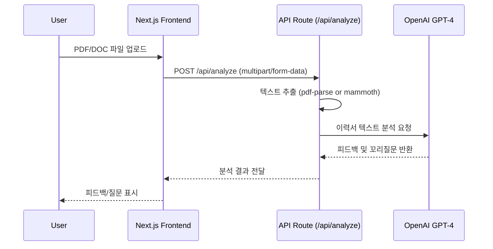

# 🧠 AI Resume Reviewer

AI를 활용해 **PDF / DOCX 형식의 이력서를 분석하고**,  
지원자의 **강점·개선점·면접 꼬리질문**을 자동으로 생성(이후 작업)하는 Next.js 기반 웹 애플리케이션입니다.

---

## 🚀 Tech Stack

| Category | Technology |
|-----------|-------------|
| **Frontend** | Next.js 16 (App Router), React 19, Tailwind CSS |
| **Backend** | Next.js API Route (`/api/analyze`), OpenAI API |
| **AI Model** | GPT-4o-mini |
| **File Parsing** | pdf-parse@1.1.1, mammoth |
| **Language** | TypeScript (ESM 환경 완전 호환) |

---

## ⚙️ 주요 기능

- ✅ **PDF / DOCX 업로드** → 텍스트 자동 추출  
- 🧠 **GPT-4o 분석** → 강점 / 개선점 / 꼬리질문 생성  
- 💬 **결과 출력** → 사용자가 브라우저에서 즉시 확인  
- 🔐 **OpenAI API Key 환경 변수 관리**

---

