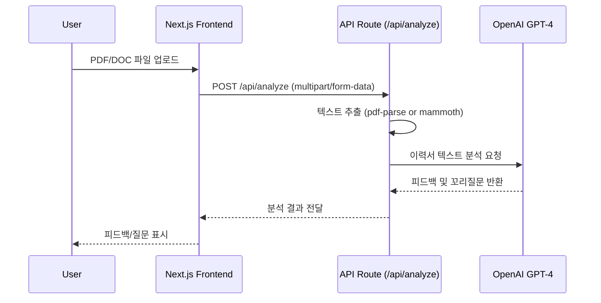

# ai-resume-reviewer

Sequence

```mermaid
sequenceDiagram
    participant U as User
    participant F as Next.js Frontend
    participant A as API Route (/api/analyze)
    participant O as OpenAI GPT-4

    U->>F: PDF/DOC 파일 업로드
    F->>A: POST /api/analyze (multipart/form-data)
    A->>A: 텍스트 추출 (pdf-parse or mammoth)
    A->>O: 이력서 텍스트 분석 요청
    O-->>A: 피드백 및 꼬리질문 반환
    A-->>F: 분석 결과 전달
    F-->>U: 피드백/질문 표시
```